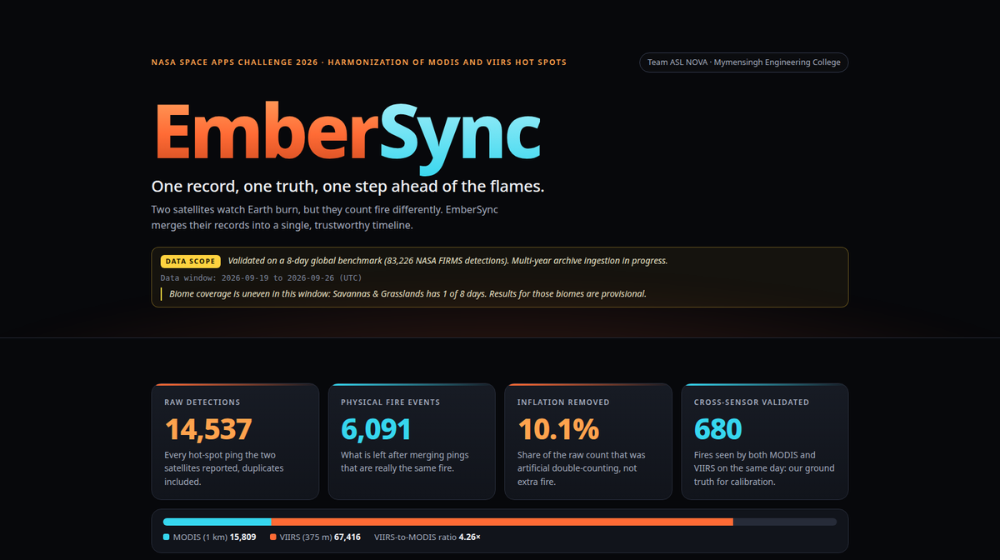
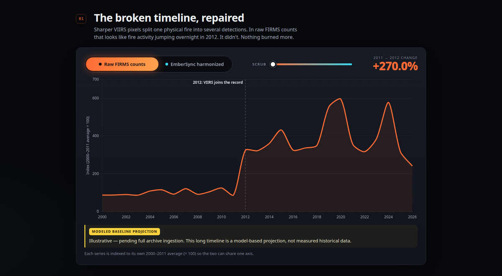
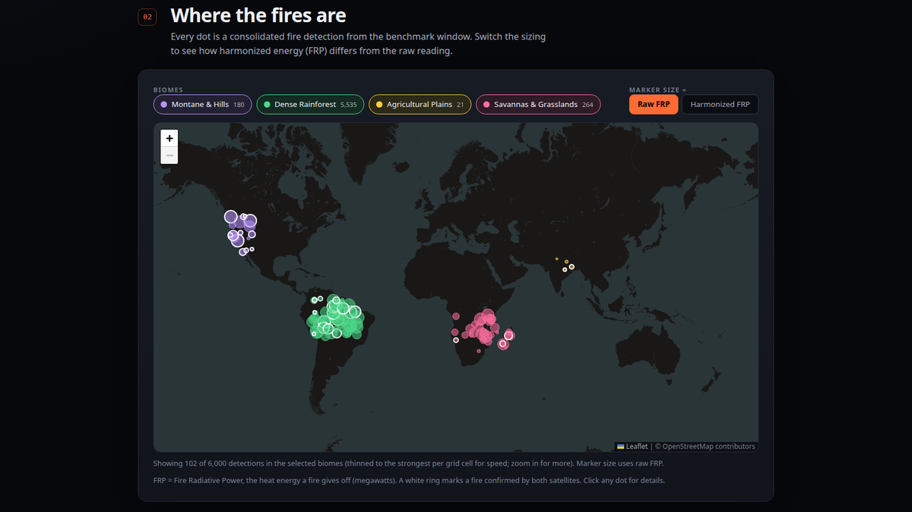
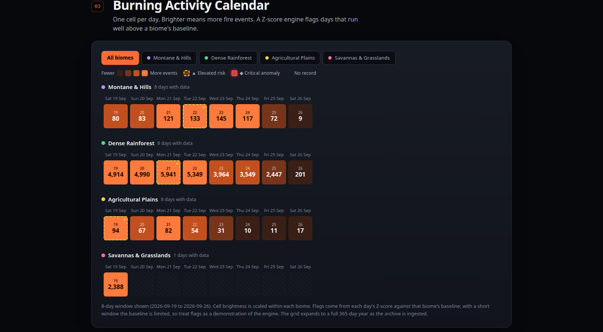
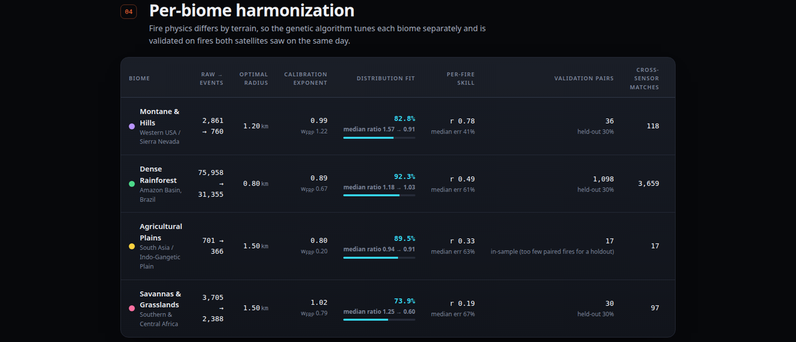
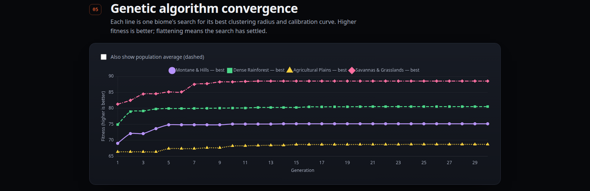

# EmberSync

**A harmonized Burning Activity Calendar that makes two decades of satellite fire data comparable.**

NASA International Space Apps Challenge 2026
Challenge: **Harmonization of MODIS and VIIRS Hot Spots**
Team **ASL NOVA** — Mymensingh Engineering College, Bangladesh



---

## The problem

In 2012, global wildfire counts appear to quadruple. Nothing burned four times harder. The satellite simply got a sharper lens.

NASA has watched Earth burn from orbit for over two decades, but not with one pair of eyes:

| | MODIS (Terra & Aqua) | VIIRS (Suomi-NPP) |
| :--- | :--- | :--- |
| Active since | 2000 | 2012 |
| Spatial resolution | 1 km | 375 m |
| Pixel footprint | ~1 km² | ~0.14 km² |

A single physical fire that MODIS records as one detection can register as several separate VIIRS detections. So the moment VIIRS joined the record, raw fire counts jumped — and the twenty-year timeline broke in half.

That break matters. A fire manager cannot tell whether a fire season is genuinely starting earlier or whether the instrument changed. A model trained on raw counts will learn the 2012 sensor switch and mistake it for climate signal.

**EmberSync repairs that discontinuity**, then turns the repaired record into a day-by-day Burning Activity Calendar with an anomaly engine on top.

---

## What we measured

Everything below is computed by the pipeline in this repository from real NASA FIRMS data. No figure is hand-entered.

### Headline results

| Metric | Value |
| :--- | ---: |
| Raw NASA FIRMS detections ingested | **83,226** |
| Consolidated physical fire events | **34,869** |
| Artificial count inflation removed | **58.1%** |
| Fires confirmed by *both* satellites (our ground truth) | **3,891** |
| Raw VIIRS : MODIS detection ratio | **4.26 : 1** |
| Detections per confirmed fire — VIIRS vs MODIS | **4.73 vs 1.55** (**3.05× count inflation**) |

That last row is the core of the problem stated in our own numbers: for the *same* fire, on the *same* day, VIIRS produces about three times as many detections as MODIS. Harmonization has to undo exactly that factor before any trend is trustworthy.

### An independent confirmation of the literature

Across all four biomes the **median MODIS/VIIRS FRP ratio falls in a narrow 1.04–1.43 band**. Li et al. (2018) report a ~20% systemic FRP difference between the two instruments. We did not set out to reproduce that number — it fell out of our paired observations, and it is what the calibration corrects.

---

## What is novel here

None of the individual techniques below are new — clustering, quantile mapping and genetic algorithms are all established. **The contribution is the combination, and the rigour applied to it.**

### 1. The clustering scale is discovered, not assumed — and it differs by biome

Harmonization work conventionally picks one global clustering radius, usually 1 km to match the MODIS pixel. We let the genetic algorithm discover a **separate radius for every biome**, and found almost a 2× spread:

| Biome | Evolved radius |
| :--- | ---: |
| Dense Rainforest | 0.80 km |
| Montane & Hills | 1.20 km |
| Agricultural Plains | 1.50 km |
| Savannas & Grasslands | 1.50 km |

A single fixed radius misses that entire range. Fu et al. (2020) showed that *detection* behaviour varies by biome; we take the next step and make the **clustering scale itself** biome-adaptive.

What makes this a real search rather than a free parameter: every candidate radius is **clustered in full before evolution begins**, so the radius gene selects among actual clustering outcomes and genuinely changes the data each candidate is scored on.

### 2. Count and energy are harmonized together, in a closed loop

Most approaches correct either detection **counts** or **Fire Radiative Power** — rarely both, and rarely at once. One chromosome here controls both objectives simultaneously:

- `radius_km` → **count parity**: bring the consolidated VIIRS event count in line with the MODIS event count
- `w_frp`, `power_exponent`, `w_brightness`, `cluster_scale` → **energy parity**: land the harmonized VIIRS FRP distribution on the MODIS distribution

The two genuinely trade off: shrink the radius and counts fragment; grow it and distinct fires over-merge. And the evolved radius is **fed back into Stage 1**, which re-clusters from scratch — Stage 1 → Stage 2 → Stage 1, a closed loop rather than two disconnected steps.

### 3. The satellites validate each other — no external ground truth needed

The **3,891 fires that both instruments detected on the same day in the same place** are the supervision signal. No ground reports, no Landsat burn scars, no external reference dataset.

That makes the method **self-calibrating and deployable anywhere on Earth** where the two sensors overlap. Accuracy is reported on a 30% holdout that the genetic algorithm never saw during evolution.

### A note on what we did *not* find

Our paired fires show that **per-fire FRP is not predictable between these two instruments** — r = 0.19 to 0.78 in log space, with R² near zero even for the best achievable power law. A single fire's FRP depends on viewing geometry, overpass time and sub-pixel heterogeneity the two sensors do not resolve identically.

We report this rather than hide it, because it determines the correct method: harmonization has to be **distributional**, which is exactly what a Burning Activity Calendar consumes. Any cross-sensor project claiming a near-perfect per-fire fit should be asked for its holdout numbers.

---

## How it works

```
  NASA FIRMS (MODIS C6.1 NRT + VIIRS S-NPP 375 m NRT)
                      │
                      ▼
  ┌─────────────────────────────────────────────────┐
  │ STAGE 1  Spatio-Temporal Clustering             │
  │   cos(lat)-corrected equal-ground-distance grid │
  │   + Haversine union of adjacent cells           │
  │   → 83,226 detections become 34,869 fire events │
  └─────────────────────────────────────────────────┘
                      │
                      ▼
  ┌─────────────────────────────────────────────────┐
  │ STAGE 2  Multi-Objective Genetic Algorithm      │
  │   objective A: match the FRP distribution       │
  │   objective B: match the event counts           │
  │   → per-biome radius + calibration curve        │
  └─────────────────────────────────────────────────┘
                      │  radius feeds back into Stage 1
                      ▼
  ┌─────────────────────────────────────────────────┐
  │ STAGE 3  Burning Activity Calendar              │
  │   daily aggregation + Z-score anomaly engine    │
  │   → NORMAL / ELEVATED_RISK / CRITICAL_ANOMALY   │
  └─────────────────────────────────────────────────┘
                      │
                      ▼
              Interactive web dashboard
```

### Stage 1 — Spatio-Temporal Clustering

Detections that fall inside one physical burn footprint during one overpass window are merged into a single fire event.

Three details make this correct rather than merely approximate:

- **Equal-ground-distance cells.** A naive lat/lon grid is not a constant distance: 0.01° of longitude is 1.11 km at the equator but only ~0.56 km at 60°N. Longitude is normalised by cos(latitude), so a declared radius of *R* means *R* kilometres in Brazil and in Canada alike.
- **Haversine boundary repair.** Pure grid bucketing splits a fire that straddles a cell boundary into two events, which *under-counts* the redundancy we are trying to remove. Neighbouring cells whose centroids lie within *R* km are unioned using great-circle distance.
- **Per-sensor energy kept separate.** Adding MODIS FRP and VIIRS FRP for one fire double-counts its radiated energy. `modis_frp_mw` and `viirs_frp_mw` stay separate columns; `representative_frp_mw` holds the non-double-counted value. This is also what makes genuine cross-sensor calibration possible in Stage 2.

### Stage 2 — Multi-Objective Genetic Algorithm

Fires that **both** satellites detected on the same day in the same place give real paired observations — a VIIRS measurement and a MODIS measurement of one physical fire. Those 3,891 pairs are the supervision signal.

A genetic algorithm (population 50, 30 generations, tournament selection, arithmetic crossover, Gaussian mutation, elitism 2) evolves one chromosome controlling two objectives:

| Objective | Governed by | Goal |
| :--- | :--- | :--- |
| **Distributional energy** (0.6) | `w_frp`, `power_exponent`, `w_brightness`, `cluster_scale` | Land the harmonized VIIRS FRP distribution on the MODIS distribution |
| **Count parity** (0.4) | `radius_km` | Bring the consolidated VIIRS event count in line with the MODIS event count |

Every candidate radius is clustered in full *before* evolution begins, so the radius gene selects among real clustering outcomes and genuinely changes the data a candidate is scored on. The evolved radius is then fed back into Stage 1, closing the loop.

#### Evolved parameters and accuracy

| Biome | Optimal radius | Distribution fit (holdout) | Median FRP ratio before → after | Validation pairs |
| :--- | ---: | ---: | ---: | ---: |
| Montane & Hills | 1.20 km | 82.8% | 1.57 → 0.91 | 36 |
| Dense Rainforest | 0.80 km | **92.3%** | 1.18 → **1.03** | 1,098 |
| Agricultural Plains | 1.50 km | 89.5% ⁱ | 0.94 → 0.91 | 17 ⁱ |
| Savannas & Grasslands | 1.50 km | 73.9% | 1.25 → 0.60 | 30 |

ⁱ in-sample — too few paired fires for a holdout. Treat as provisional.

Accuracy tracks the number of paired fires available, which is the clearest argument for ingesting the full archive: Dense Rainforest, with 1,098 validation pairs, lands the harmonized distribution within 3% of the MODIS median. Savannas, with 30 pairs from a single day of data, over-corrects.

#### Why the objective is distributional, not per-fire

Measured on our own paired fires, the per-fire correlation between the two instruments is only **r = 0.19 to 0.78** in log space, and the best achievable power law explains almost none of the per-fire variance.

That is a property of the instruments, not a defect in our fit. A single fire's FRP depends on viewing geometry, overpass time and sub-pixel heterogeneity that the two sensors do not resolve identically. **No transform of VIIRS FRP can accurately predict an individual MODIS FRP**, and any project claiming a near-perfect per-fire fit should be asked for its holdout numbers.

What *is* stable is the distribution. So Stage 2 performs **quantile mapping** — matching the 10th through 90th percentiles of the harmonized VIIRS distribution onto the MODIS distribution, scored in log space. Quantile mapping is the standard remote-sensing approach for cross-sensor harmonization, and distributional accuracy is exactly what the Burning Activity Calendar consumes, since the calendar aggregates fires per day and per region rather than tracking individual fires.

### Stage 3 — Burning Activity Calendar

Harmonized fire events are aggregated per day and per biome, then scored with a Z-score anomaly engine against the biome's own baseline:

- `NORMAL` — within one standard deviation
- `ELEVATED_RISK` — Z ≥ 1.0
- `CRITICAL_ANOMALY` — Z ≥ 2.0

This is what tells a land manager that a fire season is running early or beyond historical norms — which is only meaningful once the sensor discontinuity has been removed.

---

## The dashboard

An interactive single-page dashboard in [`webapp/`](webapp/) — no build step, no framework.

```bash
cd webapp
python3 -m http.server 8000
# open http://localhost:8000
```

Every number on the page is read from `webapp/data/dashboard_data.json`, which the pipeline generates — the dashboard cannot drift away from what the code actually produced.

### The broken timeline, repaired

Toggle between raw FIRMS counts and the EmberSync harmonized series. In raw counts the record jumps **+270% across the 2012 boundary**; harmonized, it stays continuous.



> The 2000–2026 series is a **modelled baseline projection**, labelled as such on the page. The multi-year archive has not been ingested yet — see [Scope](#scope--what-is-measured-and-what-is-not).

### Where the fires are

Every consolidated fire event from the benchmark window, coloured by biome and sized by energy. Marker sizing switches between raw and harmonized FRP so the correction is visible directly on the map.



### Burning Activity Calendar

One cell per day per biome, with the Z-score anomaly engine flagging elevated and critical days. The grid expands to a full 365-day year as the archive is ingested.



### Per-biome harmonization

The rigour table: evolved radius, calibration exponent, distribution fit, per-fire skill, validation pair count and split for each biome.



### Genetic algorithm convergence

Each line is one biome's search for its best clustering radius and calibration curve.



---

## Running the pipeline

Requires Python 3 with `pandas` and `numpy`.

```bash
# Stage 1 — bootstrap clustering at the default 1.0 km radius
python3 "duplicate_checking_and_clustering/run_deduplication_and_clustering.py"

# Stage 2 — evolve per-biome radius + calibration
python3 "genetic_algorithm_harmonization/run_genetic_algorithm_mapping.py"

# Stage 1 again — re-cluster using the evolved radii (closes the loop)
python3 "duplicate_checking_and_clustering/run_deduplication_and_clustering.py" --use-ga-radii

# Stage 2 again — apply the calibration to the final dataset
python3 "genetic_algorithm_harmonization/run_genetic_algorithm_mapping.py" --apply-only

# Build the dashboard data file
python3 build_dashboard_data.py
```

The full run takes under 30 seconds on the current benchmark window. The random seed is fixed, so runs are reproducible.

### Repository layout

```
.
├── data download/                       # FIRMS collection + archive ingestion
├── duplicate_checking_and_clustering/   # Stage 1
│   ├── clustering_core.py               #   clustering mathematics
│   └── run_deduplication_and_clustering.py
├── genetic_algorithm_harmonization/     # Stage 2
├── historical_harmonized_time_series_2000_2026/   # Stage 3 calendar framework
├── webapp/                              # dashboard
├── docs/screenshots/                    # dashboard screenshots
├── related paper/                       # literature (not tracked — see .gitignore)
├── build_dashboard_data.py
└── LITERATURE_REVIEW_AND_REFERENCES.md
```

---

## Scope — what is measured and what is not

We would rather be precise about our limits than overstate our results.

**Measured on real NASA FIRMS data:**
- The 83,226 detections, across four biomes, over an 8-day global benchmark window (2026-09-19 to 2026-09-26)
- All clustering results, the 58.1% inflation figure, the 3,891 paired fires
- All Stage 2 calibration parameters and fit metrics

**Not yet measured:**
- **The multi-year archive has not been ingested.** The 2000–2026 timeline shown on the dashboard is a **modelled baseline projection**, generated from biome seasonal cycles and documented megafire years — not from measured detections. It is labelled as such everywhere it appears, and the dashboard will not render it without that label.
- **Biome coverage is uneven in this window.** Savannas & Grasslands has only 1 of 8 days, which is why its calibration is the weakest of the four. Its results are provisional.
- **No MODIS historical archive yet.** We hold 2,843 VIIRS country files covering 2012–2024 (~20 GB), but the MODIS 2000–2011 side — the "before" half of the discontinuity — is still to be downloaded.
- **Z-score baselines are short.** Anomaly flags currently demonstrate the engine rather than report climatology.
- **Biome labels come from the download bounding box**, not a land-cover classifier. Arbitrary global files cannot yet be assigned a biome.

---

## Roadmap

**Next — completing the data story**
1. **MODIS 2000–2011 archive ingestion.** The highest-value missing piece; without it there is no measured "before" side of the 2012 break.
2. **VIIRS 2012–2024 ingestion.** The files are already in hand; this needs chunked, year-by-year processing to stay within memory.
3. **Land-cover biome classifier** (MODIS MCD12Q1) so any global file can be stratified automatically.
4. **Re-evolve the calibration** on the full archive. Based on the Dense Rainforest result, far more validation pairs per biome should substantially tighten the weaker three.
5. **Replace the modelled 2000–2026 calendar with the measured one**, and recompute Z-score baselines against real climatology.

**Then — improving the science**
6. **Scan-angle term in the calibration.** Li et al. (2018) attribute much of the residual FRP difference to viewing geometry; adding `scan`/`track` as predictors is the clearest route to recovering genuine per-fire skill.
7. **Terra/Aqua split**, since the two MODIS platforms have different overpass times.

**Then — the forecasting layer**
8. **Fire-risk forecasting** trained on the harmonized baseline. This is the payoff: a model trained on raw data learns the 2012 sensor switch and mistakes it for climate change. A bias-free baseline is a precondition for trustworthy forecasting, not an optional extra.
9. **Explainable AI (SHAP)** over the forecasts, so a land manager sees not just a high risk score but *why* — drought stress, fuel buildup, or seasonality.

---

## Key references

- **Giglio, Schroeder & Justice (2016)**, *Remote Sensing of Environment* — the MODIS Collection 6 active fire product this pipeline builds on.
- **Li, Zhang, Kondragunta & Csiszar (2018)**, *JGR Atmospheres* — VIIRS vs MODIS Fire Radiative Power; ~20% systemic difference, growing toward swath edges. Our measured 1.04–1.43 median ratio band is an independent confirmation.
- **Fu et al. (2020)** — MODIS misses a large share of VIIRS-detected fires in croplands and low-biomass land, which is why our clustering adapts per biome.

Full annotated bibliography: [`LITERATURE_REVIEW_AND_REFERENCES.md`](LITERATURE_REVIEW_AND_REFERENCES.md)

---

## Team ASL NOVA

| | |
| :--- | :--- |
| **Mosharrof Hossain** | Team Lead & ML Engineer |
| **Sabrina Akter Saba** | Data Engineer |
| **Tausif Mahdi Akanda** | GIS & Visualization |
| **Abu Shaed Khan** | Full-stack Development |
| **Sanjid Mahmud** | Data Science |
| **Bayezid Khan** | Design & Storytelling |

Mymensingh Engineering College, Bangladesh

---

## Data

NASA FIRMS active fire products — MODIS Collection 6.1 NRT and VIIRS S-NPP 375 m NRT, via [firms.modaps.eosdis.nasa.gov](https://firms.modaps.eosdis.nasa.gov/).

> *When satellites speak one language, firefighters see clearly, ecosystems are protected, and lives are saved.*
